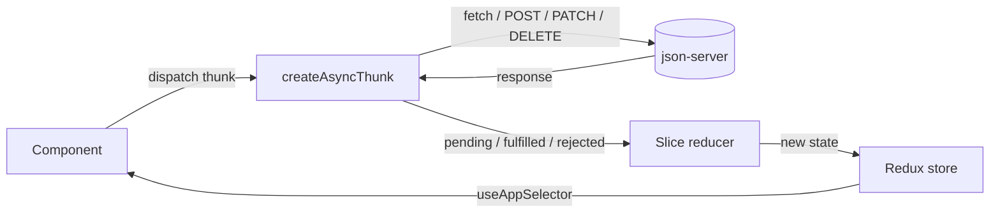
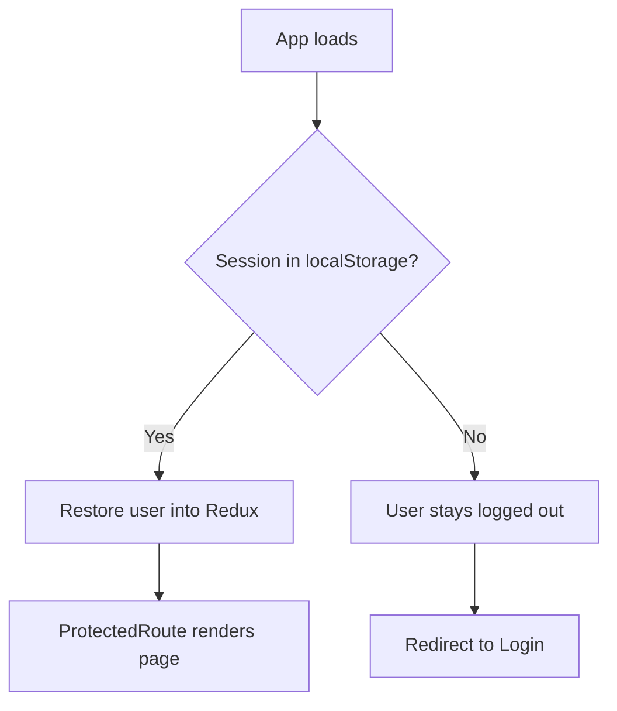

# 🛒 Shopping List App

> **Plan it. Share it. Tick it off.**
> A full-stack shopping list manager built with React, Redux Toolkit and json-server.

[](https://canva.link/yndwzgsx52yknbv)
[](https://www.figma.com/design/5TDyHiUXKaZJdL03yMhuK9/Untitled?node-id=1-2&m=dev&t=cubI5iTRyLEkJilc-1)


---

## 📑 Table of Contents

1. [The Idea](#-the-idea)
2. [Requirements Checklist](#-requirements-checklist)
3. [Features](#-features)
4. [Tech Stack](#-tech-stack)
5. [Redux Breakdown](#-redux-breakdown)
6. [App Flow](#-app-flow)
7. [Routing & Access](#-routing--access)
8. [Data Model](#-data-model)
9. [Project Structure](#-project-structure)
10. [Getting Started](#-getting-started)
11. [Design](#-design)
12. [Stretch Goals](#-stretch-goals)

---

## 💡 The Idea

Most shopping list apps are either too simple (a to-do list) or too bloated (a grocery marketplace).
This app sits in the middle: **quick to use, easy to organise, and easy to share.**

- 🗂️ **Many lists, one place** – groceries, hardware store, party supplies, each with its own category.
- ✅ **Check items off** as you shop, and see when each list was last touched.
- 🔗 **Share a list with one click** – anyone with the link can view it, no account needed.
- 🔍 **Search and sort that live in the URL**, so a filtered view can be bookmarked or shared.

---

## ✅ Requirements Checklist

| Requirement | How it is met |
|---|---|
| User registration | Register form with validation, bcrypt-hashed password, stored via json-server |
| User login / logout | Credentials checked with `bcrypt.compare`; session kept in Redux + localStorage |
| Protected pages | `ProtectedRoute` guards Dashboard, Profile and List Detail |
| Full CRUD on lists | Create, read, rename/re-categorise, delete (also deletes the list's items) |
| Full CRUD on items | Create, read, edit, toggle checked, delete |
| Search | `?search=` query param, case-insensitive, URL-synced |
| Sort | `?sort=name \| category \| dateAdded`, URL-synced |
| Share | Public read-only page at `/shared/:listId` |
| State management | Redux Toolkit slices + async thunks |
| Feedback to the user | Toasts for success/error, loading spinner, form validation messages |

---

## ✨ Features

**Accounts**
- Register with name, surname, cell number, email and password
- Validation: no empty fields, passwords must match, minimum 6 characters, no duplicate emails
- Stay logged in after a page refresh
- Profile page

**Lists**
- Create, rename, re-categorise and delete lists
- "Last updated" timestamp that refreshes whenever an item changes

**Items**
- Name, quantity, category, notes and image
- Tick items off as you shop
- Add, edit and delete from the list detail page

**Find things fast**
- Search by name
- Sort by name, category or date added (newest first by default)
- Search and sort work together: `/dashboard?search=milk&sort=category`

**Share**
- Copy a public link to the clipboard
- Read-only view with no edit, delete or checkbox controls

---

## 🧰 Tech Stack

| Layer | Tool |
|---|---|
| UI | React + TypeScript |
| Build tool | Vite |
| State | Redux Toolkit (`createSlice`, `createAsyncThunk`) |
| Routing | React Router (`useSearchParams`, route guards) |
| Backend (mock API) | json-server |
| Security | bcrypt password hashing |
| Styling | CSS Modules |
| Design | Canva + Figma |

---

## 🧠 Redux Breakdown

State is split into small slices, each owning one job. Async work (talking to json-server) lives in thunks, so components stay simple: they dispatch and read.

### Store

`store.ts` combines the slices and exports the typed helpers:

```ts
export type RootState = ReturnType<typeof store.getState>;
export type AppDispatch = typeof store.dispatch;
```

`hooks.ts` wraps these as `useAppDispatch` and `useAppSelector`, so every component gets full TypeScript autocomplete and no `any`.

### Slices

| Slice (file in `features/`) | Owns | Key thunks |
|---|---|---|
| `registerSlice.ts` | Sign-up status and errors | `registerUser` – duplicate email check, hash password, POST `/users` |
| `loginSlice.ts` | Logged-in user, session, auth status | `loginUser`, `logout`, restore session from localStorage |
| `profileSlice.ts` | Profile details of the current user | `fetchProfile`, `updateProfile` |
| `shoppingListSlice.ts` | The user's lists | `fetchLists`, `createList`, `updateList`, `deleteList` |
| `itemsSlice.ts` | Items of the open list | `fetchItems`, `createItem`, `updateItem`, `deleteItem` |

> Rename the thunks above to match your code if they differ. The pattern is what matters.

### The thunk pattern used everywhere

Every async thunk follows the same three states, handled in `extraReducers`:

| State | What the UI does |
|---|---|
| `pending` | Set `status = "loading"` and show a spinner |
| `fulfilled` | Update the store, show a success toast |
| `rejected` | Save the error message, show an error toast |

### Why this design works

- **Single source of truth** – lists, items and the user live in the store, not scattered across component state.
- **Predictable updates** – only reducers change state, and only thunks call the API.
- **Derived data, not stored data** – search and sort are **not** saved in Redux. They are read from the URL and applied to the list at render time, so the URL is the single source of truth for filters.
- **Consistency across slices** – adding or deleting an item also updates the parent list's `updatedAt`; deleting a list also clears its items from state.

---

## 🔄 App Flow



**Session restore on refresh**



---

## 🚦 Routing & Access

| Route | Page | Access |
|---|---|---|
| `/` | Home | Public |
| `/login` | Log in | Public only (logged-in users go to Dashboard) |
| `/signup` | Register | Public only (logged-in users go to Dashboard) |
| `/dashboard` | Dashboard (all lists) | 🔒 Protected |
| `/profile` | Profile | 🔒 Protected |
| `/lists/:listId` | List detail (items) | 🔒 Protected |
| `/shared/:listId` | Shared read-only list | Public, no login |

> Adjust the paths to match `App.tsx`.

`ProtectedRoute` waits for the session to finish loading (spinner), then either renders the page or redirects to Login.

---

## 🗃️ Data Model

json-server exposes three collections.

```jsonc
{
  "users": [
    {
      "id": 1,
      "name": "Sam",
      "surname": "Nkosi",
      "cellNumber": "0821234567",
      "email": "sam@example.com",
      "password": "<bcrypt hash>"
    }
  ],
  "lists": [
    {
      "id": 1,
      "userId": 1,
      "name": "Weekly groceries",
      "category": "Food",
      "notes": "",
      "createdAt": "2026-01-01T09:00:00Z",
      "updatedAt": "2026-01-01T09:00:00Z"
    }
  ],
  "items": [
    {
      "id": 1,
      "listId": 1,
      "name": "Milk",
      "quantity": 2,
      "category": "Dairy",
      "notes": "Full cream",
      "image": "",
      "checked": false,
      "createdAt": "2026-01-01T09:05:00Z"
    }
  ]
}
```

Relationships: `user 1 ── * lists` and `list 1 ── * items`.

---

## 📁 Project Structure

```
shopping-list/
├── public/
│   └── assets/
├── src/
│   ├── assets/          # images used by the UI
│   ├── components/      # reusable UI pieces
│   │   ├── FiltersBar.tsx          # search + sort controls
│   │   ├── Header.tsx / Footer.tsx / NavBar.tsx
│   │   ├── LoginForm.tsx / SignupForm.tsx
│   │   ├── ProfileCard.tsx
│   │   ├── Shoppinglists.tsx       # list of lists
│   │   └── ShoppinglistDetails.tsx # items table
│   ├── features/        # Redux slices + thunks
│   │   ├── registerSlice.ts
│   │   ├── loginSlice.ts
│   │   ├── profileSlice.ts
│   │   ├── shoppingListSlice.ts
│   │   └── itemsSlice.ts
│   ├── modules.css/     # CSS Modules, one per component/page
│   ├── pages/           # one file per route
│   │   ├── Home.tsx
│   │   ├── LogIn.tsx / SignUp.tsx
│   │   ├── Dashboard.tsx
│   │   ├── ItemsOverlay.tsx        # list detail view
│   │   ├── Profile.tsx
│   │   └── Share.tsx               # public read-only list
│   ├── routes/
│   │   └── ProtectedRoute.tsx
│   ├── types/
│   │   └── shopping.ts             # User, List, Item interfaces
│   ├── utils/
│   │   └── refreshUtils.ts         # session restore helpers
│   ├── App.tsx                     # routes
│   ├── hooks.ts                    # typed useAppDispatch / useAppSelector
│   ├── store.ts                    # configureStore + RootState
│   ├── useAuth.ts                  # auth helper hook
│   └── main.tsx                    # entry point + <Provider>
├── db.json              # json-server database
├── index.html
├── package.json
├── vite.config.ts
└── tsconfig*.json
```

**Where things belong (rule of thumb)**

| If it… | Put it in |
|---|---|
| talks to the API or changes shared state | `features/` |
| is a piece of UI used in more than one place | `components/` |
| is a full screen tied to a URL | `pages/` |
| describes the shape of data | `types/` |
| is a small helper with no UI | `utils/` |

---

## 🚀 Getting Started

**Prerequisites:** Node.js 18+ and npm.

```bash
# 1. Clone and install
git clone <your-repo-url>
cd shopping-list
npm install

# 2. Start the mock API (terminal 1)
npx json-server --watch db.json --port 3000

# 3. Start the app (terminal 2)
npm run dev
```

Open the local URL Vite prints (usually `http://localhost:5173`).

> Make sure the API port matches the base URL used in your slices.

**Quick test path**
1. Register a new account
2. Create a list, open it and add a few items
3. Tick items off, search, and change the sort order
4. Click **Share** and open the link in a private window

---

## 🎨 Design

- **Canva:** brand and visual direction (badge at the top)
- **Figma:** screen layouts and prototype (badge at the top)

---

## 🌱 Stretch Goals

Ideas to make the project stand out. Move each one into Features once it is built.

- [ ] Progress bar per list (e.g. "5 of 8 items checked")
- [ ] Optimistic UI for the checkbox (update instantly, roll back on failure)
- [ ] Filter items by checked / unchecked
- [ ] Selectors with `createSelector` for memoised search and sort
- [ ] Debounced search input
- [ ] Dark mode
- [ ] Duplicate a list ("weekly shop" template)
- [ ] Unit tests for slices and reducers

---

## 📝 Notes

- Passwords are hashed with bcrypt before being stored. This is a training project: json-server is a mock backend, and a real deployment would hash on a server, not in the browser.
- The planning pseudocode is kept in `src/` as `Shopping List Application - Pseudo.txt`. Consider moving it to a `docs/` folder.
